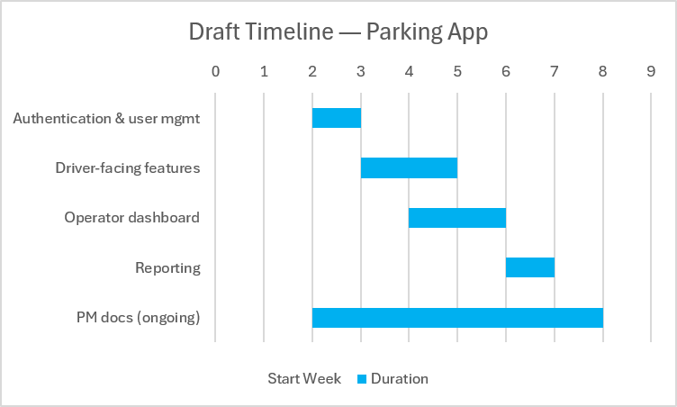

# Semester Project: Smart Parking Platform

**Version:** 0.2 (Week 2)
**Last updated:** September 11, 2026

## Table of Contents

1. [Project Overview](#project-overview)
2. [Business Need](#business-need)
3. [High-Level Requirements](#high-level-requirements)
4. [Stakeholders](#stakeholders)
5. [Development Teams](#development-teams)
6. [Project Constraints](#project-constraints)
7. [Research Component](#research-component)
8. [Weekly Update Log](#weekly-update-log)

---

## Project Overview

We are **$oftware ¢orp.**, a fictitious software development studio with unlimited resources and budget.

The project involves the planning and management of a software system that helps drivers locate, reserve, and pay for parking spaces in parking garages in real time. The platform will be available through web and mobile applications and will provide parking availability information, navigation assistance, and management tools for parking operators.

The goal is to develop a project management plan for the creation of this system, including requirements gathering, stakeholder management, scheduling, budgeting, risk management, and team coordination.

## Business Need

Drivers often spend significant time searching for available parking, leading to congestion, frustration, and lost productivity. Parking operators need better tools to monitor occupancy, manage pricing, and improve utilization of parking assets.

## High-Level Requirements

The platform should provide:

- User registration and authentication
- Real-time parking space availability
- Interactive map displaying available parking locations
- Parking reservation capability
- Digital payment processing
- Reservation history and receipts
- Administrative dashboard for parking operators
- Occupancy reporting and analytics
- Notifications and alerts for users
- Integration with external mapping/navigation services

Additional requirements will be identified through stakeholder analysis and requirements elicitation activities in upcoming weeks.

## Stakeholders

- Drivers and vehicle owners
- Parking facility operators
- City transportation departments
- System administrators
- Finance and billing personnel
- Mobile application users
- Third-party payment providers

## Development Teams

- Mobile Application Team
- Web Application Team
- Backend/API Team
- Mapping & Location Services Team
- Payment Integration Team
- Quality Assurance & Testing Team

## Project Constraints

- Unlimited theoretical development budget
- Fixed semester timeline
- Dependence on third-party services and APIs
- Compliance with security and privacy requirements, city ordinance & laws

## Research Component

## Work Breakdown Structure & Timeline

### Work Breakdown Structure (Parking App)

1. Smart Parking Platform
   1. Authentication & User Management
      1. User registration (driver)
      2. Operator registration
      3. Login / session management
      4. Password reset
   2. Driver-Facing Features
      1. Search & find available parking
      2. View garage details (price, hours, availability)
      3. Reserve a parking spot
      4. Payment processing
      5. Reservation confirmation & receipt
   3. Operator Dashboard
      1. Add / edit / remove garage
      2. Set pricing & availability rules
      3. Monitor real-time occupancy
      4. Manage reservations
   4. Reporting
      1. Occupancy graphs
      2. Revenue/financial reports
      3. Export reports (PDF/CSV)
   5. Project Management Docs
      1. Update PROJECT.md / VISION_AND_SCOPE.md / SRS.md
      2. Weekly video updates

### Draft Timeline

This is a rough draft timeline and will be refined as scope firms up.

| Phase | Weeks |
|---|---|
| Authentication & user management | 2–3 |
| Driver-facing features | 3–5 |
| Operator dashboard | 4–6 |
| Reporting | 6–7 |
| PM docs (ongoing) | 2–8 |

## Weekly Update Log

### Week 1 — September 7, 2026

- Created public GitHub repository
- Drafted initial project document (overview, business need, high-level requirements, stakeholders, development teams, constraints)
- Recorded week 1 video update for stakeholders

### Week 2 — September 11, 2026

- Created Work Breakdown Structure (3+ levels deep) for the Parking App
- Drafted project timeline including Gantt chart
- Recorded week 2 video update for stakeholders

